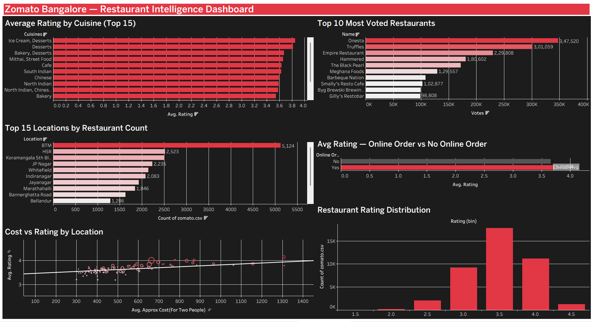

# 🍽️ Zomato Bangalore — Restaurant Intelligence Dashboard

### Tools Used: Tableau Public
### Domain: Food-Tech Analytics | Restaurant Intelligence | Consumer Insights
### Dataset: Kaggle — Zomato Bangalore Restaurants (~51,000 records)

---

## 🧭 Project Overview

This project analyzes **51,000+ real Zomato restaurant listings** from Bangalore to uncover insights about cuisine quality, location density, pricing patterns, and the impact of online ordering on ratings.

Built as a single-page interactive Tableau dashboard — the kind used by food-tech analysts at Zomato, Swiggy, and restaurant chains to make data-driven decisions about market expansion, menu pricing, and customer experience.

---

## 📊 Dashboard — Single Page, 6 Visuals

| Visual | Type | Business Question Answered |
|---|---|---|
| Average Rating by Cuisine | Horizontal Bar | Which cuisines are rated highest? |
| Top 10 Most Voted Restaurants | Bar Chart | Which restaurants have highest engagement? |
| Restaurants by Location | Bar Chart | Where is Zomato's density highest in Bangalore? |
| Online Order vs Avg Rating | Bar Chart | Does online ordering affect restaurant ratings? |
| Cost vs Rating | Scatter Plot | Do expensive restaurants rate higher? |
| Rating Distribution | Histogram | How are ratings spread across all restaurants? |

---

## 💡 Key Insights

- **Ice Cream, Desserts and Bakery** cuisines are rated highest — comfort food wins on Zomato
- **BTM Layout** has the highest restaurant density in Bangalore (5,100+ listings)
- **Restaurants with online ordering** rate slightly higher on average — suggesting better customer experience
- **Weak positive correlation** between cost and rating — expensive doesn't always mean better
- **Majority of restaurants** cluster between 3.5–4.0 rating — Zomato's quality benchmark zone

---

## 🛠️ Skills Demonstrated

- Connecting and cleaning real-world messy data in Tableau
- Calculated fields (FLOAT, LEFT functions for data type conversion)
- Filters, Top N filtering, sorting
- Multiple chart types — bar, scatter, histogram
- Dashboard assembly and layout design
- Dark theme design with brand-consistent color scheme (#E23744)
- Publishing to Tableau Public

---

## 📂 Files

| File | Description |
|---|---|
| `zomato.csv` | Raw dataset from Kaggle |
| `screenshots/dashboard.png` | Dashboard screenshot |

---

## 🔗 Live Dashboard

👉 [View on Tableau Public]([paste your Tableau Public link here])

---

## 🖼️ Dashboard Preview

---

## 👤 About

**Anurag** — Aspiring Data & MIS Analyst based in Indore, India.
Actively seeking Data Analyst, MIS Analyst, and Business Analyst roles.

[LinkedIn](#) | [GitHub](https://github.com/yourusername)
